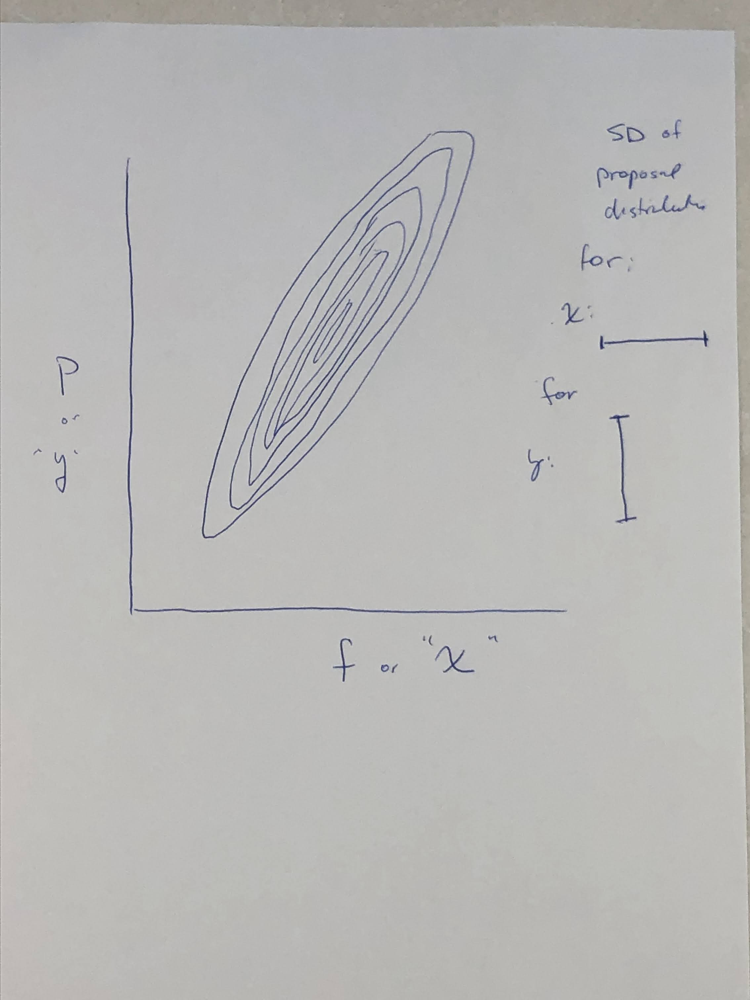

\usepackage{blkarray}
\usepackage{amsmath}
\newcommand{\bm}{\boldsymbol}
\newcommand{\Exp}{\mathbbb{E}}

This is an R-code companion to Session 7, and the contents here encompass just about 
all the material in that session.  During the lecture associated with the lesson,
we showed some OpenGL-based animations of the MCMC sampler for the inbreeding model,
but the code for that is implemented in C, and is not super accessible.  So, the goal
here is to implement, in R, the model and MCMC for the model using the several different
types of samplers discussed in the session.  

Let's load Hadley's tidyverse and other packages we need before we get going.  The following
will also install them if you don't have them. 
```{r, message=FALSE}
packs <- c("tidyverse", "plotly", "viridis", "broom")

# install any that are not here
install_em <- setdiff(packs, rownames(installed.packages()))
if (length(install_em) > 0) install.packages(pkgs = install_em)

# load em up
dump <- lapply(packs, function(x) library(x, character.only = TRUE))
```


## The joint probability

As discussed in the previous session, this is just the product of the priors and the likelihoods.  In its full glory, it looks like.  (For a review of how that joint density was developed, see
[the discussion at the very end](#review)
$$
\begin{aligned}
P(n_{AA}, n_{Aa}, n_{aa}, f, p | \alpha_f, \beta_f, \alpha_p, \beta_p) & = 
\frac{\Gamma(\alpha_f + \beta_f)}{\Gamma(\alpha_f)\Gamma(\beta_f)}f^{\alpha_f - 1}(1-f)^{\beta_f - 1}
\frac{\Gamma(\alpha_p + \beta_p)}{\Gamma(\alpha_p)\Gamma(\beta_p)}p^{\alpha_p - 1}(1-p)^{\beta_p - 1} \times \\
& \frac{n!}{n_{AA}! + n_{Aa}! + n_{aa}!}~
[fp + (1-f)p^2]^{n_{AA}}~
[(1-f)2p(1-p)]^{n_{Aa}}~
[f(1-p) + (1-f)(1-p)^2]^{n_{aa}}
\end{aligned}
$$
We will be using this in 
MCMC in which the the hyperpriors $(\alpha_f, \beta_f, \alpha_p, \beta_p)$ and the data are fixed.
Thus the terms (factors) that involve _only_ the data and the hyperpriors are constants that will drop
out of the Hastings ratio, so they can be safely ignored.  So, our joint probability can be computed
as something that looks like:
$$
\begin{aligned}
P(n_{AA}, n_{Aa}, n_{aa}, f, p | \alpha_f, \beta_f, \alpha_p, \beta_p) & \propto 
f^{\alpha_f - 1}(1-f)^{\beta_f - 1}
p^{\alpha_p - 1}(1-p)^{\beta_p - 1} \times \\
& ~~~~[fp + (1-f)p^2]^{n_{AA}}~
[(1-f)2p(1-p)]^{n_{Aa}}~
[f(1-p) + (1-f)(1-p)^2]^{n_{aa}}
\end{aligned}
$$
We will implement this in a function that returns the _log_ of the above quantity
so that we won't run into underflow issues with very large samples:
```{r joint}
#' the log of the joint probability of all the data and paramaters given the priors
#'
#' This is computed having dropped all the constant factors in the probability.
#' @param n a vector of three elements: (nAA, nAa, naa), the number of AA's, the
#' number of Aa's, and the number of aa's
#' @param f the inbreeding coeffient
#' @param p the frequency of the A allele
#' @param pri a vector of four components: (alpha_f, beta_f, alpha_p, beta_p) which are the 
#' beta parameters for the priors on f and p.  By default they are all 1.
log_joint_prob <- function(n, f, p, pri = c(1, 1, 1, 1)) {
  # not going to do much error checking here
  
  # compute the raw values, anything outside of the unit interval we will send
  # back as NaN
  ifelse(f <= 0 | f >= 1 | p <= 0 | p >= 1, NaN,
         log(f) * (pri[1] - 1) + 
           log(1 - f) * (pri[2] - 1) +
           log(p) * (pri[3] - 1) +
           log(1 - p) * (pri[4] - 1) +
           log(f * p + (1 - f) * p ^ 2) * n[1] +
           log((1 - f) * 2 * p * (1 - p)) * n[2] + 
           log(f * (1 - p) + (1 - f) * (1 - p) ^ 2) * n[3])
  
  

}
```
Note that this function is vectorized over $f$ and $p$, but not $n$ or the priors.


### A 3-D plot

We can compute the joint probability of all the variables easily, and, because this is a toy problem 
in two dimensions, we can visualize roughly what the posterior surface will look like by 
computing values on a grid and normalizing those values so they sum to one.  Let's do that, since
it is a good chance to introduce the [plotly](https://plot.ly/r/) package to anyone that might not yet know it.

So, let's take the example from the lecture and set our data to be $n_{AA} = 30$, $n_{Aa} = 10$, and 
$n_{aa} = 10$.  Those are the expected values if $f = 0.5$ and $p = 0.7$,
```{r}
ndata <- c(30, 10, 10)
```
and then compute the log prob, exponentiate it, and normalize it over a grid of value for
$f$ and $p$:
```{r}
f_vals <- seq(0, 1, by = 0.03)
p_vals <- seq(0, 1, by = 0.03)

# make a tidy tibble of values 
grid_vals <- expand.grid(f = f_vals, p = p_vals) %>%
  as_tibble() %>%
  mutate(joint = exp(log_joint_prob(ndata, f, p))) %>%
  mutate(norm_joint = joint / sum(joint, na.rm = TRUE)) %>%
  select(-joint)

# then put those values into a matrix, with rows corresponding to f and cols to p
probs <- matrix(grid_vals$norm_joint, nrow = length(f_vals), ncol = length(p_vals))

```
Now we can plot it with plotly:
```{r, fig.width=8}
plot_ly(x = ~p_vals, y = ~f_vals, z = ~probs) %>%
  add_surface()
```

Try interacting with that plot, especially if you are not familiar with plotly.  You can zoom, pan, and
revolve it, and you can also look at individual values by mousing over within the plot.

## "2-D" Metropolis-Hastings Sampler

We now start our forays into different MCMC samplers, roughly following the lecture notes from the session. 
The first is a sampler in which we propose changes to both $f$ and $p$ and then we accept or reject both of those
proposaled changes, together, in one fell swoop, according to the Hastings Ratio.

For our proposals in this case we will use two independent, symmmetrical normal distributions centered
on the current values.  We will wrap up the whole process in a single function
called `mcmc_2d_mh()`.
```{r}
#' function to do MCMC using a "2-D" Metropolis-Hastings sampler
#' @param ndata a three-vector (nAA, nAa, naa) of the observed data
#' @param pri a vector of four components: (alpha_f, beta_f, alpha_p, beta_p)
#' @param init a two vector of starting values (f, p).  Each should be within the
#' unit interval.
#' @param sweeps the number of sweeps (i.e proposed changes) to do in the MCMC chain.
#' @param f_sd the standard deviation of the normal distribution for proposing new values to f
#' @param p_sd the standard deviation of the normal distribution for proposing new values to p
#' @return returns a tibble of proposals made, values visited, values of MH ratio, etc
mcmc_2d_mh <- function(ndata, 
                       pri = c(1, 1, 1, 1), 
                       init = c(.2, .5), 
                       sweeps = 500,
                       f_sd = 0.07,
                       p_sd = 0.07) {

  # create vectors in which to store output. Note that we will be storing 
  # the proposed values and the MH-ratio each sweep, too, for later analysis.
  f <- p <- fprop <- pprop <- mh_ratio <- rep(NA_real_, sweeps + 1)
  accepted_f <- accepted_p <- rep(NA, sweeps + 1)
  
  # put initial values in
  f[1] <- init[1]
  p[1] <- init[2]
  
  # then cycle over sweeps
  for (i in 1:sweeps) {
    
    # propose new values
    fprop[i] <- rnorm(1, f[i], f_sd)
    pprop[i] <- rnorm(1, p[i], p_sd)
    
    # compute the hastings ratio
    # the log M-H ratio is the difference of the log joint probs.
    # since the proposal distributions are symmetrical they drop out of the ratio.
    mh_ratio[i] <- exp(log_joint_prob(ndata, fprop[i], pprop[i], pri) -
      log_joint_prob(ndata, f[i], p[i], pri))
    
    # now, if mh_ratio[i] is NaN it means that f or p was proposed outside of the unit interval
    # and it should be rejected immediately.  If not, then we simulate a uniform R.V. on (0, 1)
    # and reject the proposal if that number is greater than the MH-ratio.
    if (is.nan(mh_ratio[i]) || runif(1) > mh_ratio[i]) {# reject!
      accepted_f[i] <- FALSE
      accepted_p[i] <- FALSE
      f[i + 1] <- f[i]
      p[i + 1] <- p[i]
    } else {# accept!
      accepted_f[i] <- TRUE
      accepted_p[i] <- TRUE
      f[i + 1] <- fprop[i]
      p[i + 1] <- pprop[i]
    }
    
  }
  
  # in the end, make a tibble and return
  tibble(sweep = 1:(sweeps + 1),
         f = f,
         p = p, 
         proposed_f = fprop,
         proposed_p = pprop,
         mh_ratio = mh_ratio,
         accepted_f = accepted_f,
         accepted_p = accepted_p
         )
}
```

**A brief note:** In the above function (and the one following) we are being careful to record
not just the current state of the chain, but also
every _proposed_ value.  Typically this is not done in MCMC.  Rather, it is more usual to simply
record the state of the chain at each sweep (or at some "thinned" interval of sweeps). However
we wanted to keep a full record of the progression of all the variables so that they would be
available for  students to peruse or analyze. 


## Component-wise Metropolis-Hastings Sampler

Rather than proposing changes to both $f$ and $p$ before accepting or rejecting them,
we can propose just a change to $f$ (say) and accept or reject the proposal, and then propose just a change
to $p$, and then accept or reject that.  This is called component-wise Metropolis-Hastings sampling. 
Underlying it is a central theme in MCMC, which is that just one or a few dimensions can be changed
with each proposal, but as long as the acceptance or rejection of each proposal is done in
a way that satisfies detailed balance, _and_ as long as all the different types of proposals,
when used together create an irreducible chain around the space, then you get a valid MCMC sampler.

We make a function that looks much like `mcmc_2d_mh()`, but in which the proposal and acceptance steps
for $f$ and $p$ are done separately within each sweep. This is going to look a little bit weird
because we do each update within the sweep but set the new value of $f$ in the "next" sweep.
(You'll see below...)
```{r}
#' function to do MCMC using a component-wise Metropolis-Hastings sampler
#' @param ndata a three-vector (nAA, nAa, naa) of the observed data
#' @param pri a vector of four components: (alpha_f, beta_f, alpha_p, beta_p)
#' @param init a two vector of starting values (f, p).  Each should be within the
#' unit interval.
#' @param sweeps the number of sweeps (i.e proposed changes) to do in the MCMC chain.
#' @param f_sd the standard deviation of the normal distribution for proposing new values to f
#' @param p_sd the standard deviation of the normal distribution for proposing new values to p
#' @return returns a tibble of proposals made, values visited, values of MH ratio, etc
mcmc_cw_mh <- function(ndata, 
                       pri = c(1, 1, 1, 1), 
                       init = c(.2, .5), 
                       sweeps = 500,
                       f_sd = 0.07,
                       p_sd = 0.07) {

  # create vectors in which to store output. Note that we will be storing 
  # the proposed values and the MH-ratio each sweep, too, for later analysis.
  f <- p <- fprop <- pprop <- mh_ratio_f <- mh_ratio_p <- rep(NA_real_, sweeps + 1)
  accepted_f <- accepted_p <- rep(NA, sweeps + 1)
  
  # put initial values in
  f[1] <- init[1]
  p[1] <- init[2]
  
  # then cycle over sweeps
  for (i in 1:sweeps) {
    
    # propose new value for f
    fprop[i] <- rnorm(1, f[i], f_sd)
    
    # compute the hastings ratio with only a change to f proposed
    mh_ratio_f[i] <- exp(log_joint_prob(ndata, fprop[i], p[i], pri) -
      log_joint_prob(ndata, f[i], p[i], pri))
    
    # then accept or reject it
    U <- runif(1)
    if (is.nan(mh_ratio_f[i]) | runif(1) > mh_ratio_f[i]) {# reject!
      accepted_f[i] <- FALSE
      f[i + 1] <- f[i]
    } else {# if accepted, then update the value of f
      accepted_f[i] <- TRUE
      f[i + 1] <- fprop[i] # set the value.  This is a little weird because we are still in sweep i.
    }
    
    # now, the current value of f is stored in f[i + 1], and we propose a new value for p
    pprop[i] <- rnorm(1, p[i], p_sd)
    
     # compute the hastings ratio using the new f and the proposed value of p
    mh_ratio_p[i] <- exp(log_joint_prob(ndata, f[i + 1], pprop[i], pri) -
      log_joint_prob(ndata, f[i + 1], p[i], pri))
    
    
    # and reject or accept the proposal
    if (is.nan(mh_ratio_p[i]) | runif(1) > mh_ratio_p[i]) {# reject!
      accepted_p[i] <- FALSE
      p[i + 1] <- p[i]
    } else {# if not accepted then make p the same as the current p
      accepted_p[i] <- TRUE
      p[i + 1] <- pprop[i]
    }
    
  }
  
  # in the end, make a tibble and return
  tibble(sweep = 1:(sweeps + 1),
         f = f,
         p = p, 
         proposed_f = fprop,
         proposed_p = pprop,
         mh_ratio_f = mh_ratio_f,
         mh_ratio_p = mh_ratio_p,
         accepted_f = accepted_f,
         accepted_p = accepted_p
         )
}
```


## Using the samplers

Each of these Metropolis-Hastings samplers returns output in a tibble. For example:
```{r}
mcmc_cw_mh(ndata = c(30, 10, 10))
```

## Exercises

1. Run each of the samplers for 5000 sweeps, with `ndata = c(30, 10, 10)`.
```{r}
mcmc_run <- list(
  component_wise = mcmc_cw_mh(ndata = c(30, 10, 10), sweeps = 5000),
  two_d_sampler = mcmc_2d_mh(ndata = c(30, 10, 10), sweeps = 5000)
) %>%
  bind_rows(.id = "sampler")
```

2. Plot the traces for $f$ and $p$ for both the 2-d and the componentwise sampler. Are they visibly different?
```{r}
# look at the f's
ggplot(mcmc_run, aes(x = sweep, y = f)) +
  geom_line() +
  facet_wrap(~ sampler, nrow = 1)
```

```{r}
# look at the p's
ggplot(mcmc_run, aes(x = sweep, y = p)) +
  geom_line() +
  facet_wrap(~ sampler, nrow = 1)
```


3. Compare the acceptance rates for $p$ and $f$ for both samplers. 
```{r}
mcmc_run %>%
  group_by(sampler) %>%
  summarise(
    f_accept = mean(accepted_f, na.rm = TRUE),
    p_accept = mean(accepted_p, na.rm = TRUE)
  )
```
4. In 3 you should have found that the acceptance rate is higher in the component-wise sampler (as expected).

5. This was a simple exercise in sampling continuous random variables according to a two dimensional
posterior surface.  Now, imagine that the standard deviations of the proposal distributions for $p$ and $f$ are fixed, then, draw (by hand) the level curves (a "contour" plot) of a 2-d posterior surface for which the
2-d sampler might have a higher acceptance rate than the component wide sampler.  Draw the standard deviations
of the proposal distributions on for scale.

_A two dimensional surface that is "tilted" (showing high correlation between f and p). If the standard devation is much greater than the "width" of the posterior, then changes in only f or p would often
be rejected_

For example:
```{r, echo=FALSE, out.width='100%'}

```


## Review of the model {#review}

We are dealing with a very simple model for inbreeding.  It is one type of
model that might be used to account for an excess of homozygotes in a sample 
from a population.  We assume that we have taken a sample of $n$ diploid
individuals from the population, and we will be considering just a single
locus at a time.   This locus has two alleles $A$ and $a$, and our sample 
can be summarized by (what turns out to be the sufficient statistic, in this
case) the numbers of the three possible genotypes: $n_{AA}$, the number of
$AA$ homozygotes; $n_{Aa}$, the number of heterozygotes; and $n_{aa}$, the
number of $aa$ homozygotes.  Of course, $n_{AA} + n_{Aa} + n_{aa} = n$.

In a population with no inbreeding, the expected fraction of genotypes follows
the Hardy-Weinberg equilibrium proportions.  Letting $p$ denote the frequency of the
$A$ allele in the population, under Hardy-Weinberg equilibrium the, expected fractions
of the different genotypes are:
$$
\begin{aligned}
P_\mathrm{HW}(AA) & = p^2 \\
P_\mathrm{HW}(Aa) & = 2p(1-p)\\
P_\mathrm{HW}(aa) & = (1-p)^2
\end{aligned}
$$

### Basic probabilities

Inbreeding in a population violates one of the many assumptions required for Hardy-Weinberg
equilibrium to hold.  We model inbreeding here as a property of the pair of gene copies
that occur in an individual in the population, and we measure it with the population
inbreeding coefficient, $f$, which can be interpreted as the probability
that the pair of gene copies in an individual randomly sampled from the population are _identical
by descent_, or IBD for short.  For our purposes in this session, we will take "identical by descent" to mean that
they are both copies of the same, recent ancestral gene copy.  More important than the exact
definition of "identical by descent" adopted here are the consequences for two gene copies of
being IBD.  And in this case, that is very simple: we will assume that if 
two gene copies are IBD, then they must also be the same allelic type.  In other
words, if two gene copies are IBD, and the first of them is allele $A$, then the second must
also be allele $A$.  

So, given the inbreeding coefficient $f$, we can compute the probability that
a randomly sampled individual has the genotype $AA$, $Aa$, or $aa$.  First, let us consider
$P(AA)$: with probability $f$ the two gene copies at a locus in the individual are IBD, 
in which case only the first gene copy must by $A$, since the second one will be too.  On the other hand, with probability $(1-f)$ the two gene copies at the locus in the
individual are not IBD, and so the probability of being $AA$ is just the standard Hardy-Weinberg 
probability, $P_\mathrm{HW}(AA) = p^2$.  Hence, under the inbreeding model:
$$
\begin{aligned}
P(AA) &= fp + (1-f)p^2 \\
P(Aa) &= f\times 0 + (1-f)2p(1-p) \\
P(aa) &= f(1-p) + (1-f)(1-p)^2
\end{aligned}
$$

### The likelihood
Now recall that our data are $(n_{AA}, n_{Aa}, n_{aa})$---the numbers of the different genotypes
observed in the sample.  To move forward in inference, we need to be able to compute the 
likelihood, which is the probability of our data given the values of the parameters: $P(n_{AA}, n_{Aa}, n_{aa}|p,f)$.
Note here that the two parameters in our model are $p$, the frequency of the $A$ allele in the population,
and $f$, the population inbreeding coefficient.  We assume that each individual is sampled independently
from the population, so the likelihood is a multinomial:
$$
P(n_{AA}, n_{Aa}, n_{aa}) = \frac{n!}{n_{AA}! + n_{Aa}! + n_{aa}!}~
[fp + (1-f)p^2]^{n_{AA}}~
[(1-f)2p(1-p)]^{n_{Aa}}~
[f(1-p) + (1-f)(1-p)^2]^{n_{aa}}
$$
The multinomial coefficient is a constant with respect to $p$ and $f$ so it will drop out.  

### The priors

We need priors of $p$ and $f$.  These are proportions, so a natural choice is the beta distribution.  
Let's define $f \sim \mathrm{Beta}(\alpha_f, \beta_f)$ and $p \sim \mathrm{Beta}(\alpha_p, \beta_p)$,
and we will set up our model that way, though the default values we will use are
$\alpha_f = \beta_f = \alpha_p = \beta_p = 1$ which will give us uniform priors for $f$ and $p$.  
